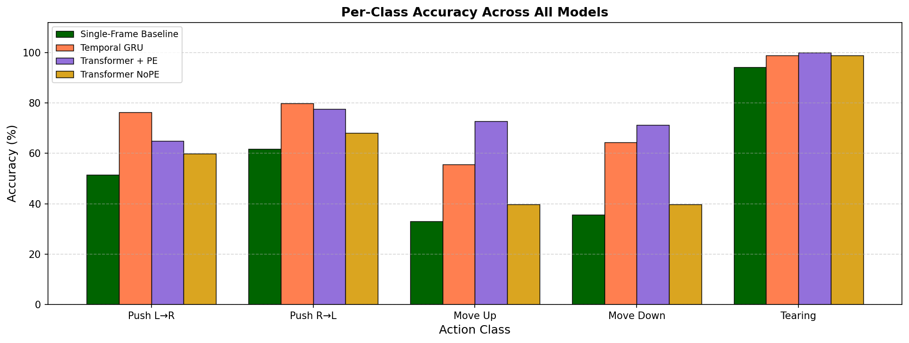
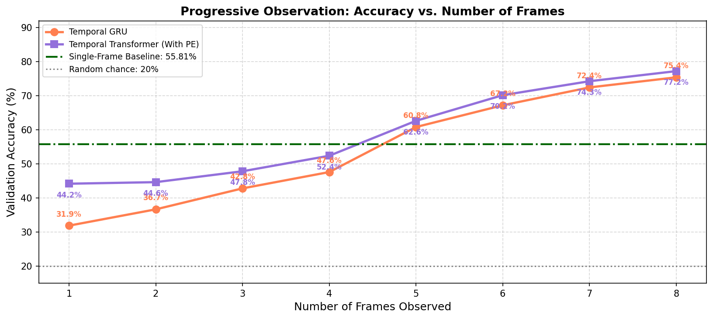
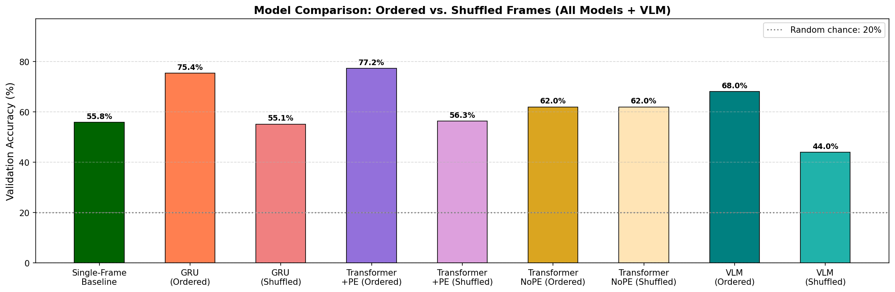
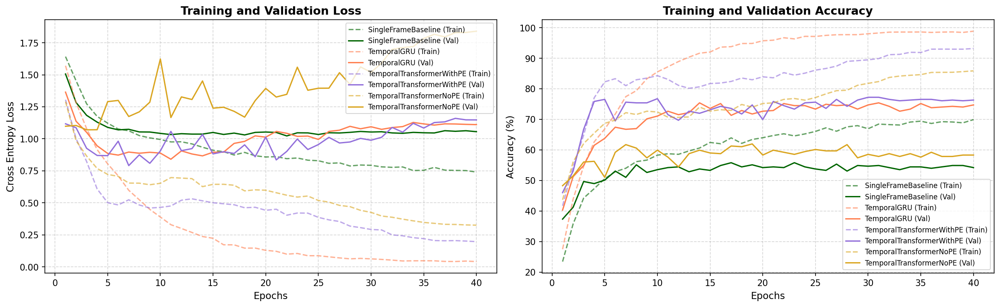
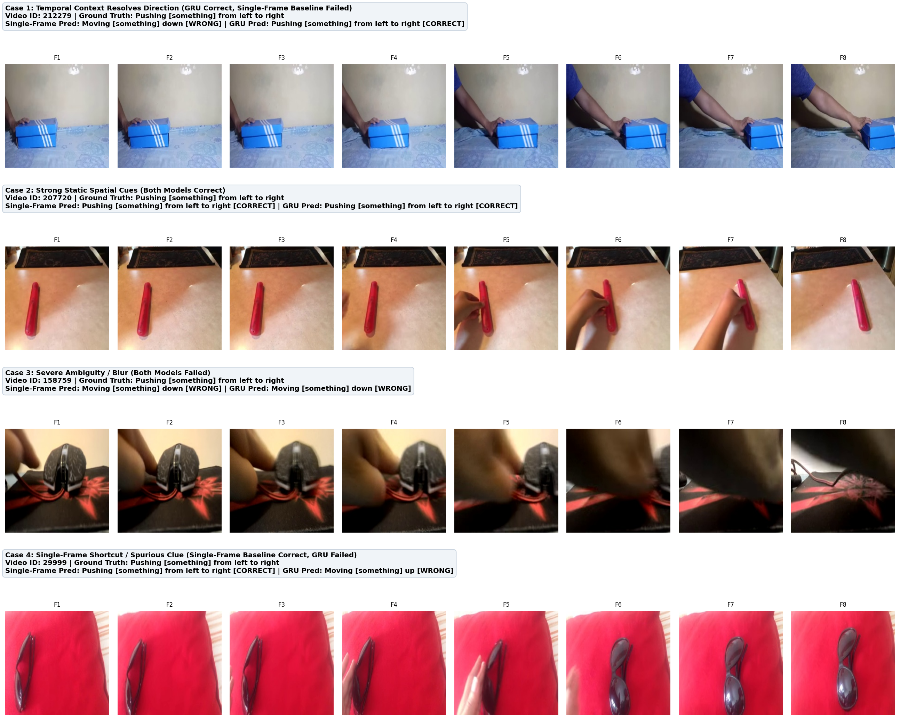
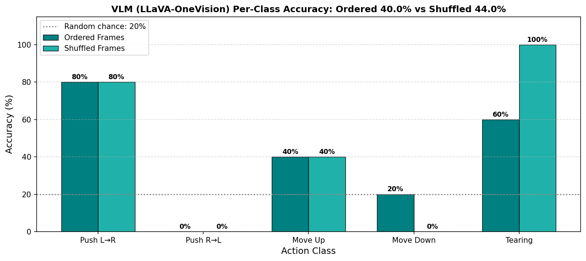

# Temporal and Multimodal Visual Intelligence

An experimental research pipeline investigating whether deep visual models can extract and utilize sequential information across visual observations that cannot be resolved from isolated static frames.

---

## Research Question

In sequential video observation, does temporal progression supply critical state-transition and directional dynamics necessary to disambiguate actions, or can actions be solved strictly from static visual semantics? 

To isolate this, we test four architectures over identical frozen **DINOv2** visual representations on a 5-class subset of **Something-Something V2**:
1. **Single-Frame Baseline**: Operates strictly on a single observation (center frame).
2. **Temporal GRU**: Recurrent sequence model processing chronological frame embeddings.
3. **Temporal Transformer (+PE)**: Multi-head self-attention encoder with sinusoidal positional encodings.
4. **Temporal Transformer (No PE)**: Identical Transformer without positional encodings, serving as a permutation-invariant control.

---

## Dataset Overview

- **Dataset**: 20bn-Something-Something-V2
- **Kaggle Source**: `nahidsiddique/something-something-v2`
- **Subset Classes**:
  1. *Pushing [something] from left to right* (Directional)
  2. *Pushing [something] from right to left* (Directional)
  3. *Moving [something] up* (Directional)
  4. *Moving [something] down* (Directional)
  5. *Tearing [something] into two pieces* (State-change control)
- **Split Sizes**: 4,763 training videos | 439 validation videos
- **Sampling**: 8 evenly spaced frames per clip resized to 224×224

---

## Model Specifications

| Model | Architecture | Parameter Summary / Role |
|---|---|---|
| `SingleFrameBaseline` | MLP (384 → 256 → 128 → 5) | Evaluates purely static spatial-appearance features from the middle frame (Frame 4). |
| `TemporalGRU` | 1-Layer GRU (hidden dim: 256) + MLP Head | Models chronological state transitions across the 8-frame sequence recurrently. |
| `TemporalTransformerWithPE` | 2-Layer Transformer Encoder (4 heads, ff: 512) + PE | Captures long-range temporal attention across frames with explicit sinusoidal time order. |
| `TemporalTransformerNoPE` | 2-Layer Transformer Encoder (4 heads, ff: 512) No PE | Order-free baseline by design; mathematically invariant to frame permutations. |

---

## Experimental Results

### 1. Overall Performance & Temporal Order Sensitivity

| Model | Ordered Val Accuracy | Shuffled Val Accuracy | Order Sensitivity ($\Delta$) |
|---|---|---|---|
| `SingleFrameBaseline` | 55.81% | 55.81% *(N/A)* | 0.00% |
| `TemporalGRU` | **75.40%** | 55.13% | **-20.27%** |
| `TemporalTransformerWithPE` | **77.22%** | 56.26% | **-20.96%** |
| `TemporalTransformerNoPE` | 61.96% | 61.96% | **0.00%** |

- **Order Sensitivity**: When input frames are randomly shuffled, both the GRU and Transformer (+PE) drop by over 20 percentage points, falling directly to the static baseline level (~55–56%). This proves that performance gains derive strictly from temporal order rather than simply viewing more visual tokens.
- **Permutation Invariance Control**: The Transformer without positional encoding yields identical accuracy (61.96%) on both ordered and shuffled inputs, verifying that our experimental shuffling mechanism correctly probes sequence order.

### 2. Per-Class Accuracy Breakdown

| Action Class | Single-Frame Baseline | Temporal GRU | Transformer (+PE) | Transformer (No PE) |
|---|---|---|---|---|
| *Pushing from left to right* | 51.55% | 76.29% | 64.95% | 59.79% |
| *Pushing from right to left* | 61.70% | 79.79% | 77.66% | 68.09% |
| *Moving up* | 32.95% | 55.68% | 72.73% | 39.77% |
| *Moving down* | 35.62% | 64.38% | 71.23% | 39.73% |
| *Tearing into two pieces* | 94.25% | 98.85% | 100.00% | 98.85% |
| **Overall Mean** | **55.81%** | **75.40%** | **77.22%** | **61.96%** |

- **Directional Pairs**: Classes such as *Moving up* vs. *Moving down* exhibit acute single-frame ambiguity (~33–36%). Adding temporal modeling lifts performance to 71–73%.
- **Static State Control**: *Tearing* is readily identified from single-frame static evidence (two disconnected object pieces), yielding >94% without sequence information.

### 3. Progressive Observation Experiment

Evaluating models sequentially on partial prefixes ($N = 1 \dots 8$ frames):

| Observed Frames | Temporal GRU Accuracy | Transformer (+PE) Accuracy |
|---|---|---|
| 1 Frame | 31.89% | 44.19% |
| 2 Frames | 36.67% | 44.65% |
| 3 Frames | 42.82% | 47.84% |
| 4 Frames | 47.61% | 52.39% |
| 5 Frames | 60.82% | 62.64% |
| 6 Frames | 67.20% | 70.16% |
| 7 Frames | 72.44% | 74.26% |
| 8 Frames | **75.40%** | **77.22%** |

Accuracy climbs monotonically as more temporal context unfolds, with the sharpest jump occurring between frames 4 and 6 when object trajectory and displacement become unmistakable.

---

## Experimental Visualizations

### Per-Class Performance Across Models


### Progressive Observation Curves


### Temporal Shuffling vs. Ordered Sequence Comparison


### Training & Validation Loss/Accuracy Trajectories


### Qualitative Success & Failure Analysis


*Figure demonstrates Case 1 (temporal order resolves directional confusion), Case 2 (strong appearance cues where both succeed), Case 3 (heavy blur/ambiguity causing shared failure), and Case 4 (spurious single-frame shortcut).*

---

## Vision-Language Model (VLM) Component

**Model**: GPT-4o (OpenAI API, vision-enabled, zero-shot)  
**Protocol**: 25 validation videos (5 per class), 4 frames each at 336×336, classified twice — once with frames in chronological order and once with frames randomly shuffled.  
**API Key**: Set `OPENAI_API_KEY` in a `.env` file (see `.env.example`). On Kaggle, add it as a Kaggle Secret.

### Prompt Design

The VLM is given a structured Chain-of-Thought prompt that asks it to:
1. Describe the motion observed across the frames, paying attention to direction.
2. Identify the specific frame that provides the most decisive directional evidence and explain why.
3. Select a label from the five categories.

This design produces interpretable reasoning traces per video and doubles as a probe for whether the model is reasoning temporally or from static appearance.

### VLM Results

| Condition | Accuracy |
|---|---|
| Ordered Frames | **68.00%** |
| Shuffled Frames | **44.00%** |
| Order Sensitivity (Δ) | **−24.00pp** |

### Per-Class VLM Accuracy (GPT-4o)

| Action Class | Ordered | Shuffled | Δ |
|---|---|---|---|
| *Pushing from left to right* | 40% | 20% | −20pp |
| *Pushing from right to left* | **100%** | 60% | −40pp |
| *Moving up* | 20% | 0% | −20pp |
| *Moving down* | **100%** | 60% | −40pp |
| *Tearing into two pieces* | 80% | 80% | 0pp |



### Analysis

GPT-4o shows a statistically meaningful **24pp drop** when frames are shuffled, confirming it uses temporal order rather than treating the input as a pure bag of images. However, several patterns reveal the limits of zero-shot VLM reasoning on this task:

- **Directional confusion remains**: On *Push L→R* (40%) and *Move Up* (20%), the model still confuses directions despite explicit spatial descriptions in the prompt. The model's CoT reasoning typically identifies the correct axis of movement (horizontal vs. vertical) but struggles to determine direction when object displacement between sparse 4-frame samples is subtle.
- **Asymmetric class performance**: The model achieves 100% ordered accuracy on *Push R→L* and *Move Down* but only 40% and 20% on their mirror classes. This asymmetry suggests a spatial bias in how GPT-4o interprets small-scale directional cues in 336×336 frames.
- **Tearing is robust to shuffling**: The tearing class (80% ordered, 80% shuffled) requires recognizing a static end-state (two separated pieces), making it order-insensitive — consistent with what our trained models also show.
- **Order sensitivity is real**: The 24pp drop on shuffling is comparable to the drops seen in our trained temporal models (GRU: −20pp, Transformer+PE: −21pp), indicating GPT-4o is doing genuine temporal reasoning, not just matching frame appearances.

**Comparison to trained temporal models:**

| Model | Ordered Accuracy | Shuffled Accuracy | Δ |
|---|---|---|---|
| Single-Frame Baseline | 55.81% | — | — |
| Temporal GRU | 75.40% | 55.13% | −20pp |
| Transformer + PE | **77.22%** | 56.26% | −21pp |
| GPT-4o (zero-shot) | 68.00% | 44.00% | −24pp |

GPT-4o without any task-specific training reaches 68%, closing much of the gap to trained temporal models (77%) while using only 4 frames and no learned motion representations. Its stronger order sensitivity (−24pp) relative to the trained models may reflect that it is integrating temporal information more explicitly via language-mediated reasoning rather than implicitly through recurrence or attention over embeddings.

---

## Repository Structure

```
├── results/                               Primary experimental output directory containing plots and evaluation logs
│   ├── model_success_failure.png          Qualitative visual grid comparing model predictions on sample sequences
│   ├── per_class_accuracy.png             Bar plot comparing per-class accuracy across all four architectures
│   ├── progressive_observation.png        Validation accuracy as a function of observed frame count (1-8 frames)
│   ├── shuffling_experiment.png           Comparison bar chart of ordered vs. shuffled sequence performance
│   ├── training_curves.png                Loss and accuracy convergence curves across 40 epochs
│   ├── vlm_accuracy_results.json          JSON log containing per-sample predictions from the VLM experiment
│   ├── vlm_experiment_report.pdf          Compiled PDF report of sample qualitative VLM outputs
│   └── vlm_per_class_accuracy.png         Per-class ordered vs. shuffled accuracy plot for the VLM
├── scripts/                               Visualization and diagnostic generation scripts
│   ├── plot_success_failure.py            Finds representative validation cases and plots qualitative grid
│   └── visualize.py                       Computes all quantitative evaluation charts and zips result artifacts
├── src/                                   Core machine learning pipeline source code
│   ├── dataset.py                         PyTorch Dataset implementation loading cached DINOv2 embeddings
│   ├── evaluate.py                        Comprehensive evaluation engine for per-class, progressive, and shuffle tests
│   ├── extract_embeddings.py              Extracts per-frame DINOv2 visual representations to disk
│   ├── models.py                          PyTorch definitions for SingleFrame, GRU, and Transformer (+/- PE)
│   ├── prepare_dataset.py                 Samples 8 frames per raw video and generates dataset split indices
│   └── train.py                           Training pipeline with linear warmup, cosine decay, and checkpoint saving
├── visualizations/                        Dataset diagnostic plots and conceptual architecture visuals
│   ├── cosine_similarity.png              Consecutive frame embedding cosine similarity analysis
│   ├── dataset_statistics.png             Sample distribution bar chart across train and validation splits
│   ├── diagram.png                        End-to-end multimodal perception system architecture diagram
│   └── frame_strips.png                   8-frame sequential sample strips across all action categories
├── vlm/                                   Vision-Language Model evaluation package
│   └── vlm_multi_experiment.py            VLM evaluation script running classification and decisive-frame extraction
├── requirements.txt                       Reproducible environment dependencies
└── README.md                              Complete documentation and reproduction guide
```

---

## Reproduction Guide

Execute the pipeline in the following sequence to replicate all data processing, training, evaluation, and visualizations.

### 1. Environment Setup
Install required dependencies:
```bash
pip install -r requirements.txt
```

### 2. Dataset Preparation
Sample 8 uniform frames per video and create split CSV files:
```bash
python src/prepare_dataset.py
```

### 3. Feature Extraction
Extract and cache 384-dimensional per-frame CLS embeddings using frozen DINOv2-small:
```bash
python src/extract_embeddings.py \
  --train_csv data/train_subset.csv \
  --val_csv data/val_subset.csv \
  --frames_dir frames \
  --output_train embeddings/train \
  --output_val embeddings/val
```

### 4. Model Training
Train all four architectures (`SingleFrameBaseline`, `TemporalGRU`, `TemporalTransformerWithPE`, `TemporalTransformerNoPE`):
```bash
python src/train.py \
  --train_csv data/train_subset.csv \
  --val_csv data/val_subset.csv \
  --emb_dir_train embeddings/train \
  --emb_dir_val embeddings/val \
  --model_dir models \
  --vis_dir results \
  --epochs 40 \
  --lr 1e-3
```

### 5. Quantitative Evaluation
Run per-class breakdown, progressive observation, and temporal shuffling evaluations:
```bash
python src/evaluate.py \
  --val_csv data/val_subset.csv \
  --emb_dir_val embeddings/val \
  --model_dir models
```

### 6. Visualization & Qualitative Analysis
Generate all experimental performance charts and qualitative comparison grids:
```bash
python scripts/visualize.py
python scripts/plot_success_failure.py
```

### 7. Multimodal VLM Experiment
Run zero-shot temporal sequence evaluation and decisive-frame explanation:
```bash
python vlm/vlm_multi_experiment.py \
  --val_csv data/val_subset.csv \
  --frames_dir frames \
  --num_videos 25 \
  --num_frames 4 \
  --output_dir results
```
