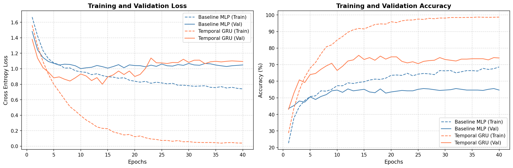
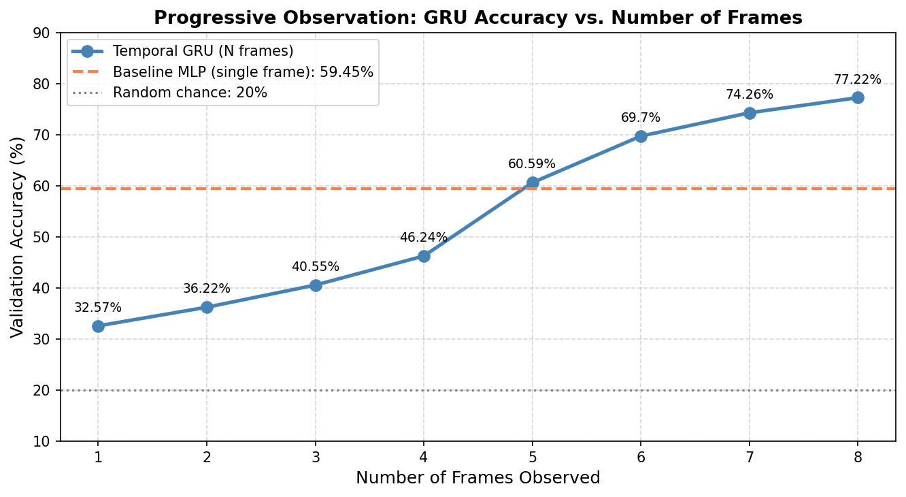
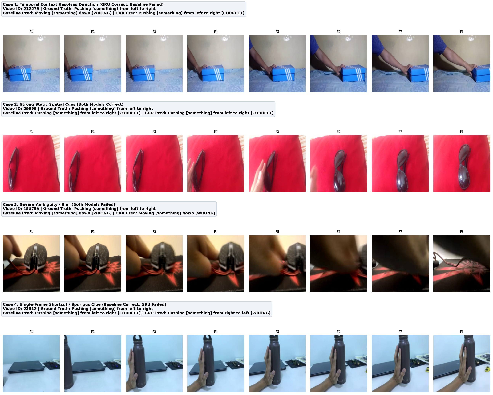

# Temporal and Multimodal Visual Intelligence

An experimental system investigating whether a model can extract and utilize useful information from a sequence of visual observations that is not available from any individual frame alone.

The core research question: does seeing frames over time actually help a model recognize an action, or can it solve the task from a single static snapshot?

## Kaggle Implementation

The entire pipeline, model training, evaluation, and VLM experiment were executed on Kaggle:
[Vaibhav's Kaggle Notebook](https://www.kaggle.com/code/vaibhav1908/temporal-multimodal-vlm)

## Dataset Information

**Dataset**: 20bn-something-something-v2
**Kaggle Source**: `nahidsiddique/something-something-v2`

*   **Labels directory**: `/kaggle/input/datasets/nahidsiddique/something-something-v2/20bn-something-something-download-package-labels/labels`
*   **Videos directory**: `/kaggle/input/datasets/nahidsiddique/something-something-v2/20bn-something-something-v2/20bn-something-something-v2`

Selected 5-class subset:
1. Pushing something from left to right
2. Pushing something from right to left
3. Moving something up
4. Moving something down
5. Tearing something into two pieces

**Dataset split sizes**:
*   Training set: 4763 videos
*   Validation set: 439 videos
*   Frames per video: 8 evenly-spaced frames resized to 224x224

## Key Results

*   **Baseline MLP (Mean-Pooled 8 Frames)**: 55.58%
*   **Temporal GRU (8-Frame Sequence)**: 75.63%
*   **Temporal GRU (Shuffled Frames)**: 55.58%

The temporal model outperforms the mean-pooled baseline by exactly 20 percentage points. The fact that the Shuffled GRU perfectly matches the Baseline (55.58%) proves that the 20-point gain comes entirely from the GRU's ability to learn temporal sequential order, rather than just observing more visual features.

**Progressive Observation Experiment**:
*   1 frame: 30.52%
*   2 frames: 34.85%
*   3 frames: 40.77%
*   4 frames: 48.52%
*   5 frames: 54.90%
*   6 frames: 67.43%
*   7 frames: 72.21%
*   8 frames: 75.63%

**Temporal Order Shuffling Experiment**:
*   Ordered sequence accuracy: 75.63%
*   Shuffled sequence accuracy: 55.58%
*   Accuracy drop: 20.05 percentage points

## Visualizations





All experimental plots and figures are saved in the `visualizations/` directory:

*   `training_curves.png`: Training and validation loss/accuracy curves across 25 epochs
*   `dataset_statistics.png`: Sample counts per class across train and validation splits
*   `frame_strips.png`: 8-frame temporal strip for one sample per action class
*   `cosine_similarity.png`: Cosine similarity between consecutive DINOv2 frame embeddings
*   `progressive_observation.png`: Accuracy curve as a function of observed frame count
*   `shuffling_experiment.png`: Comparison between baseline, ordered GRU, and shuffled GRU
*   `model_success_failure.png`: Qualitative comparison of success and failure cases across models
*   `vlm_frame_analysis.png`: Annotated 4-frame strip analyzed by LLaVA 1.5 7B
*   `vlm_experiment_report.pdf`: 3-page standalone ReportLab PDF report of multi-video VLM experiments
*   `diagram.jpg`: System architecture diagram for multimodal perception

## VLM Experiment Output

**Model**: LLaVA 1.5 7B (4-bit quantized)
**Ground Truth Class**: Pushing something from left to right
**Video ID**: 29999

**Prompt**:
These are 4 sequential frames from a video.
1. Describe what is changing across each sequential frame.
2. What action and direction of movement is taking place?
3. Is Frame 1 alone ambiguous to determine the full action? At which frame does the movement become clear and why?

**LLaVA Output**:
1. In the first frame, a pair of sunglasses is being held by a person. The sunglasses are being held up, and the person is looking at them.
2. The person is holding the sunglasses up, possibly to examine them or to put them on. The direction of movement is upwards, as the person is raising the sunglasses.
3. Frame 1 is ambiguous to determine the full action because the sunglasses are not clearly visible in the frame. The movement becomes clear in the subsequent frames, as the person is holding the sunglasses up in the second frame and placing them on their face in the third frame.

**Analysis**:
LLaVA correctly deduced that Frame 1 is ambiguous and that sequence context is required to resolve the action, directly supporting the empirical finding from the progressive observation experiment (where 1-frame accuracy was only 32.57%). The VLM provides qualitative interpretability, while the GRU delivers precise numerical classification.

## Repository Structure

```
src/
    dataset.py             PyTorch Dataset loading pre-extracted DINOv2 numpy embeddings
    extract_embeddings.py  Extracts 384-dim CLS embeddings per frame using DINOv2
    models.py              BaselineMLP and TemporalGRU model definitions
    prepare_dataset.py     Extracts 8-frame strips from raw webm videos and creates CSV splits
    train.py               Training loop with Adam optimizer and checkpoint saving
    evaluate.py            Runs baseline, progressive observation, and shuffling experiments

vlm/
    vlm_experiment.py      Runs 4-bit LLaVA 1.5 7B on sample sequential frames
    vlm_multi_experiment.py Runs LLaVA on multiple videos across different classes
    save_vlm_frames.py     Generates the annotated 4-frame visualization strip

scripts/
    visualize.py           Generates all quantitative evaluation charts and figures
    plot_success_failure.py Generates qualitative success and failure case figures

visualizations/            Output directory containing all generated charts and diagrams

report/
    technical_report.docx    Complete technical report

README.md                  Documentation and reproduction guide
requirements.txt           Python dependencies
ASSIGNMENT_REQUIREMENTS.md Project specifications and rubric
```

## Reproduction Steps

1. Install requirements:
   `pip install -r requirements.txt`

2. Run dataset preparation:
   `python src/prepare_dataset.py`

3. Extract visual embeddings:
   `python src/extract_embeddings.py`

4. Train models:
   `python src/train.py`

5. Run evaluation experiments:
   `python src/evaluate.py`

6. Run VLM experiments:
   `python vlm/vlm_experiment.py`
   `python vlm/vlm_multi_experiment.py`

7. Generate visualizations:
   `python scripts/visualize.py`
   `python scripts/plot_success_failure.py`
   `python vlm/save_vlm_frames.py`

   
